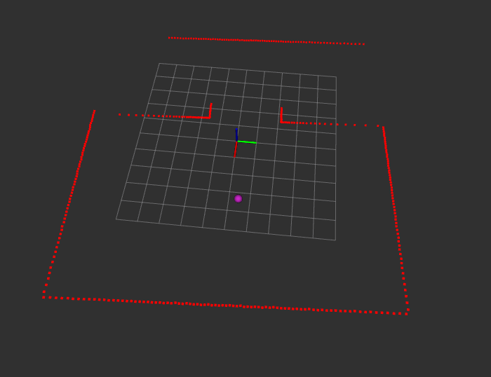

# Poles of Inaccessibility problem solver

The project is the static library solving a problem of [Poles of Inaccessibilty]("https://www.researchgate.net/publication/232984998_Poles_of_inaccessibility_A_calculation_algorithm_for_the_remotest_places_on_Earth"), or in other words, the problem of finding the largest inscribed circle in an irregular polygon.
 
 

  

## Library features
 
The largerst inscribed circle center can be calculated using two methods:
 

1. Monte Carlo
    
> PolarPoint PIASolver::solveMonteCarlo(std::vector<float> vertices, float angleInc)
    
2. All points in region

> PolarPoint PIASolver::solve(std::vector<float> vertices, float angleInc)

Where `vertices` is the vector of ranges from a center to vertice, and `angleInc` is the angular difference of the ranges. These variables can be got by LaserScan ros message.

## Examples
 
    

        
    

 

The CMakeLists will produce test program, which recieve LaserScan message from `ray/scan` topic and publish PoseStamped message on `room_center` topic

### Examples requirements
ROS Noetic